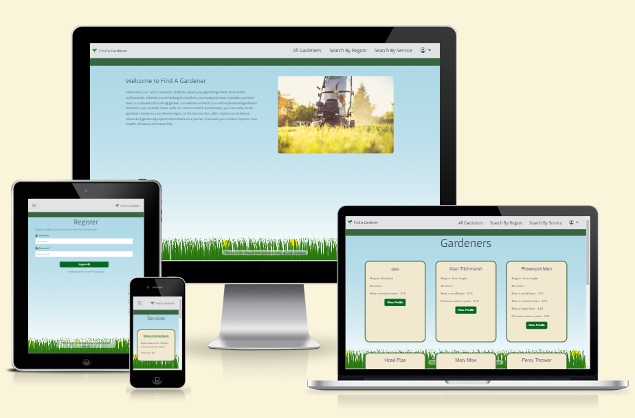

# Find a Gardener

Find a Gardener is a website that will provide a list of available gardeners and their respective services. 

The users of the website will be able to find gardeners in their area and find more information about them.

The other user of the website will be the gardener themselves who can create a profile to log in to and can add, update or delete their information profile.

### Live project

Find the live project [here](https://find-a-gardener-2f0e9afaf839.herokuapp.com/)

## Table of Contents
1. [**UX**](#ux)
    - [**Strategy Plane**](#strategy-plane)
        - [**User Stories**](#user-stories)
    - [**Scope Plane**](#scope-plane)
        - [**Features**](#features)
            - [**Current Features**](#current-features)
            - [**Future Features**](#future-features)
    - [**Structure Plane**](#struture-plane)
        - [**Wireframes**](#wireframes)
        - [**Database Design**](#database-design)
    - [**Surface Plane**](#surface-plane)
        - [**Color Scheme**](#color-scheme)
        - [**Imagery**](#imagery)
        - [**Typography**](#typography)
- [**Technologies Used**](#technologies-used)
    - [**Languages](#languages)
    - [**Frameworks, Libraries and Programs Used**](#frameworks-libraries-and-programs-used)
4. [**Testing**](#testing)
5. [**Issues**](#issues)
5. [**Deployment**](#deployment)
    - [**Local Deployment**](#local-deployment)
    - [**Remote Deployment**](#remote-deployment)
6. [**Credits**](#credits)

---

# UX

## Strategy Plane

Target Audience

The target audience of this website are people looking for a gardener.

User Requirements and Expectations

All users of the site will expect:
- Links and buttons to work logically.
- A simple and intuitive navigation system.
- Interactive feedback and notifications.
- Information presented in a clear and concise manner.
- A visually appealing design.
- A simple way to create an account.
- A simple way to log in for existing users.
- The ability to add, edit or delete own data.
- The security of their own profile protected by a hashed password login shield.
- Accessibility.

### User Stories

As any user:
    1. I want to understand the purpose of the site on first entry.
    2. I want to be able to navigate the site easily and intuitively.
    3. I want to be able to view the website on any device.
    4. I want to be able to return to the home page without using browser buttons if I encounter an error.
    5. I want to view a list of available gardeners.
    6. I want to search for gardeners by region or by services offered.

As a logged out user:

    7. I want to be able to easily register a new account.
    8. I want to be able to locate a log in page easily.

As a logged in user:

    9. I want to be able to add, view, edit or delete my own profile.
    10. I want to receive feedback when I've completed an action. 

As a logged in admin User:

    11. I want to be able to add, edit or delete regions.
    12. I want to be able to add, edit or delete services offered.

## Scope Plane

### Features

#### Current Features

---

Home Page

Nav Bar

Footer

* 

Register Form

* 

Login Form

* 

Add Gardener Form

* 

All Gardener Cards

* 

Full Profile

* 

Regions

* 

Search By Region

* 

Services

* 

Search By Service

* 

User Edit and Delete

* 

Management Nav Items

* 

Edit and Delete Gardener 

* 

Delete Modal 

* 

Edit and Delete Services 

* 

Edit and Delete Region 

* 

Edit Gardener Form 

* 

Edit Region Form 

* 

Edit Service Form 

* 

#### Future Features

A number of features could be added to the website in order to enhance its business case use. For example:

- The ability for Gardeners to be able to add their own services and determine their own price.
- A bio section containing contact details for each gardener only accessible to logged in customers.
- For users to be able to record a score or review of a gardener whom they may have hired.
- For users to be able to filter results by first and second level conditions.

## Structure Plane

### Wireframes

To follow best practice, wireframes have been developed to guide the project throughout its development. Device sizes for desktop, tablet and mobile have been created for the core pages using [Balsamiq](https://balsamiq.com/)

Home Page

* Home Page 

---

Register Form

* Register Form 

---

Login Page

* Login Page 

---

All Gardeners Page

* All Gardeners Page 

---

Add profile

* Add Profile Page 

---

Regions

* Regions List Page 

---

Search By Region

* Search By Region Page 

---

Services

* Services List Page 

### Database Design

## Surface Plane

#### Color Scheme

I chose a colour scheme that closely resembles the industry that the website is categorised in, nature and gardens. Synonymous with eco and nature, green was a colour that would dominate on this website. The complimentary color to green, red, I have used to style any danger buttons for example delete. 

#### Imagery

The site only contains one image, used on the home page. Sourced from Pexels.

#### Typography

Google Fonts Varela Rounds, Cabin and Gafata, sans serif were used across the site for simplistic design.

# Technologies Used

## Languages 

- [HTML5](https://en.wikipedia.org/wiki/HTML5)
- [CSS3](https://en.wikipedia.org/wiki/CSS)
- [Python](https://www.python.org/)

## Frameworks, Libraries and Programs Used

- [GitHub](https://github.com/) - GitHub has been utilised to store the repository of my project.

- [Gitpod](https://www.gitpod.io/) - Utilised for version control

- [Heroku](https://www.heroku.com/) - Used for deployment and app management

- [Flask] (https://flask.palletsprojects.com/) - A Python framework utilised within this project. 

- [Jinja](https://jinja.palletsprojects.com/) - Jinja templating engine utilised for generating dynamic content in the project's web pages.

- [Bootstrap CSS](https://getbootstrap.com/) - Bootstrap CSS framework applied for responsive and visually appealing design elements in the project.

- [Google Fonts](https://fonts.google.com/) - Google Fonts integrated to enhance typography choices and visual aesthetics in the project.

- [Font Awesome](https://fontawesome.com/) - Utilised for icons.

- [Werkzeug](https://werkzeug.palletsprojects.com/) - Utilised the security helper function for password hashing. 

- [SQLAlchemy](https://www.sqlalchemy.org/) - SQLAlchemy ORM utilised for simplified database interactions.

- [ElephantSQL](https://www.elephantsql.com/) - ElephantSQL cloud service utilised for hosting the PostgreSQL database.

- [Balsamiq](https://balsamiq.com/) -  Balsamiq wireframing tool utilized for creating mock-ups to visualize the project's user interface design.

- [LucidChart](https://www.lucidchart.com/) - LucidChart utilised for creating database schema for clear visual representations to aid in planning and documentation for the project.

- [Am I Responsive](https://ui.dev/amiresponsive) - Utilised to check if the site is responsive on different screen sizes.

- [W3C Markup Validator](https://validator.w3.org/#validate_by_input) - was used to validate HTML

- [W3C CSS Validator](https://jigsaw.w3.org/css-validator/) - was used to validate CSS

- [Coolors](https://coolors.co/9df57a-3c444c-fee73b-ff4f98-2daaf3-a9bedb) - to make color palette

# Testing

For More information on testing [see here](https://github.com/paddyw11/find-a-gardener/blob/main/TESTING.md)

# Issues

Region error in post add_gargener form. I realised form posts were not adding to the database for the gardener base. I added some print statements to test how the form was functioning. Some print statements identified an issue at the point of identifying the selected region on the form.

In adding an image to the home page. Upon launching a port and after deployment I couldn't fathom how to get the image to load, following the same steps from previous projects. Upon learning a server hosted app doesn't load file in the same manner I opted to load the image directly from its URL source.

In deployment I was receiving an error relating to the greenlet plugin, it was required I install a newer version. 

# Deployment

## Local Deployment

### How this site can be forked on GitHub

1. On GitHub.com, navigate to the repository [here](https://github.com/paddyw11/find-a-gardener).
2. In the top-right hand corner, click on 'Fork'.
3. By default, forks are named the same as their parent repositories. You can change the name of the fork to distinguish it further.
4. Add a description of your fork.
5. Click 'Create Fork.

### How this site can be cloned

1. Log into GitHub or set up a new account.
2. Navigate to the repository [here](https://github.com/paddyw11/find-a-gardener)
3. Click on the code button, select whether to clone with HTTPS, SSH or GitHub CLI and copy the link shown.
4. Open a terminal in a new IDE workspace where you wish to clone the repository to.
5. Type 'git clone' into the terminal and paste the link copied from the original source repository and press the Enter key to begin the clone process.

## Remote Deployment

### Creating a Database with ElephantSQL

1. Log in with GitHub to the ElephantSQL.
2. Create new team.
3. Click 'Create New Instance'.
4. Choose your plan.
5. Select your region.
6. Click 'Review'.
7. Click 'Create instance'.
8. Click on the name of your database and copy the URL to your clipboard.

### Deploying the app on Heroku

1. Type `pip3 freeze --local > requirements.txt` into the Gitpod terminal to create a requirements.txt file.
2. Type `echo web: python app.py > Procfile` into the terminal to create a Procfile.
3. Commit and push the changes to GitHub.
4. Create a Heroku Account and log in.
5. Click 'New' -> 'Create new app'.
6. Enter a name for your project and select your region.
7. Click 'Create app'.
8. Go to 'Settings', click 'Reveal Config Vars'.
9. Add the following variables:
    * DATABASE_URL: your ElephantSQL database url
    * IP: 0.0.0.0
    * PORT: 5000
    * SECRET_KEY: your secret key
    * DEBUG: True
10. Click on the 'Deploy' tab.
11. Click 'Connect to GitHub'.
12. Find your repo and click 'Connect'
13. Click 'Deploy Branch'.
14. Click 'More' -> 'Run console'
15. Type in `python3`
16. Type `from findagardener import db` -> `db.create_all()` -> `exit().`
17. Click 'Open App'.

# Credits

## Images and Text

- Pexels - Home Page Image [Magic K Photography](https://www.pexels.com/@magic-k-24827758/)
- ChatGPT 3.5 - Home Page Text [Open AI](https://chat.openai.com/)

## Code

- Code Pen - Grass Footer [@Tillberger](https://codepen.io/tillberger/pen/MWqbWZJ)
- Project Exemplar - Ludido [M. Nowak](https://github.com/mmnowak/mp3_ludido)

## Thanks

I would like to thank CI course cohort lead, Amy and Mentor Daniel for their encouragement.