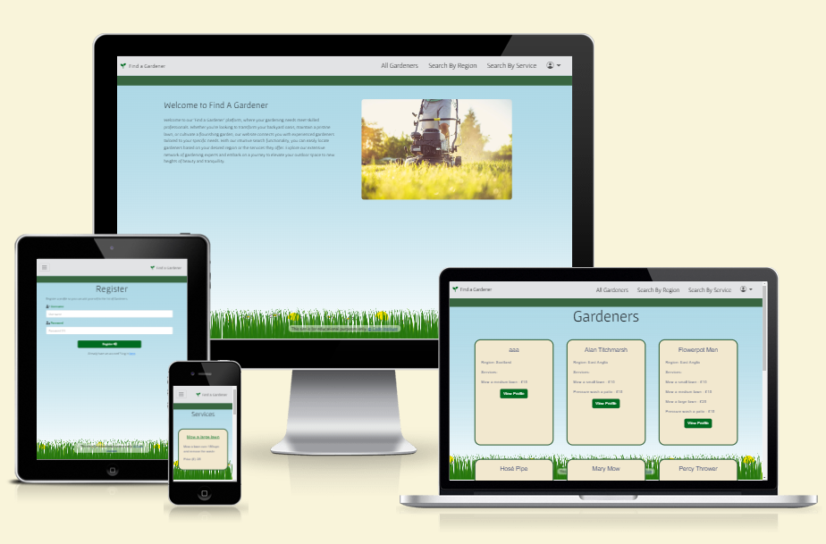

# Find a Gardener database

(Developer: Paddy Walsh)

[Live Webpage](https://find-a-gardener-2f0e9afaf839.herokuapp.com/)

This is the testing documentation for the Find a Gardener website. For the README file, [click here](https://github.com/paddyw11/find-a-gardener/blob/main/README.md)

## Table of Contents

1. [Validation](#validation)
    1. [HTML Validation](#html-validation)
    2. [CSS Validation](#css-validation)
    3. [Python Linting](#python-linting)
    4. [Accessibility Testing](#accessibility-testing)
    5. [Performance Testing](#performance-testing)
2. [Manual Testing](#manual-testing)
    1. [Device Testing](#device-testing)
    2. [Browser compatibility](#browser-compatibility)
    3. [Testing User Stories](#user-story-testing)
    4. [Feature Testing](#feature-testing)

# Validation

## HTML Validation

The W3C Markup Validation Service was used to validate the HTML of the website. All errors found were corrected, currently there are no errors.

[Home Page](https://validator.w3.org/nu/?doc=https%3A%2F%2Ffind-a-gardener-2f0e9afaf839.herokuapp.com%2F)

[All Gardeners](https://validator.w3.org/nu/?doc=https%3A%2F%2Ffind-a-gardener-2f0e9afaf839.herokuapp.com%2Fgardeners)

[Gardener Profile Page](https://validator.w3.org/nu/?doc=https%3A%2F%2Ffind-a-gardener-2f0e9afaf839.herokuapp.com%2Ffull_profile%2FAlan%2520Titchmarsh)

[Services Page](https://validator.w3.org/nu/?doc=https%3A%2F%2Ffind-a-gardener-2f0e9afaf839.herokuapp.com%2Fservices)

[Search By Services](https://validator.w3.org/nu/?doc=https%3A%2F%2Ffind-a-gardener-2f0e9afaf839.herokuapp.com%2Fgardeners_by_service%2F4)

[Regions Page](https://validator.w3.org/nu/?doc=https%3A%2F%2Ffind-a-gardener-2f0e9afaf839.herokuapp.com%2Fregion)

[Search by Regions](https://validator.w3.org/nu/?doc=https%3A%2F%2Ffind-a-gardener-2f0e9afaf839.herokuapp.com%2Fgardeners_by_region%2F7)

[Add Gardener Profile](https://validator.w3.org/nu/?doc=https%3A%2F%2Ffind-a-gardener-2f0e9afaf839.herokuapp.com%2Fadd_gardener)

[Register Page](https://validator.w3.org/nu/?doc=https%3A%2F%2Ffind-a-gardener-2f0e9afaf839.herokuapp.com%2Fregister)

[Login Page](https://validator.w3.org/nu/?doc=https%3A%2F%2Ffind-a-gardener-2f0e9afaf839.herokuapp.com%2Flogin)

## CSS Validation

The W3C Jigsaw CSS Validation Service was used to validate the css file for the website via file upload. No errors were found.

## Python Linting

All python files were run through the [Python linter](https://pep8ci.herokuapp.com/). There were a number of errors coming from either the lines being too long, over/under indentation and whitespace. The errors have since been corrected.

**routes.py file:**

**models.py file:**

## Accessibility Testing

The pages were run through the [WAVE Web Accessibility Evaluation Tool](https://wave.webaim.org/).
There were no errors. The alerts mostly related to skipped heading levels. 

See results:

[Home Page](https://wave.webaim.org/report#/https://find-a-gardener-2f0e9afaf839.herokuapp.com/)

[All Gardeners](https://wave.webaim.org/report#/https://find-a-gardener-2f0e9afaf839.herokuapp.com/gardeners)

[Services Page](https://wave.webaim.org/report#/https://find-a-gardener-2f0e9afaf839.herokuapp.com/services)

[Search By Services](https://wave.webaim.org/report#/https://find-a-gardener-2f0e9afaf839.herokuapp.com/gardeners_by_service/3)

[Regions Page](https://wave.webaim.org/report#/https://find-a-gardener-2f0e9afaf839.herokuapp.com/region)

[Search by Regions](https://wave.webaim.org/report#/https://find-a-gardener-2f0e9afaf839.herokuapp.com/gardeners_by_region/7)

[Add Gardener Profile](https://wave.webaim.org/report#/https://find-a-gardener-2f0e9afaf839.herokuapp.com/add_gardener)

[Register Page](https://wave.webaim.org/report#/https://find-a-gardener-2f0e9afaf839.herokuapp.com/register)

[Login Page](https://wave.webaim.org/report#/https://find-a-gardener-2f0e9afaf839.herokuapp.com/login)

## Performance Testing

### Home

### All Gardeners

### Services Page

### Search By Services

### Regions Page

### Search By Regions

### Register Page

### Login Page

# Manual Testing

## Device Testing

The website was tested on the following devices:

- Samsung Galaxy A04s
- iPhone 8+
- iPhone 13
- Motorola G54
- Mac Book Pro
- HP Envy 17-ch0500sa
- ACER G236HL Monitor
- Dell SE2722HX Monitor
- Google Chrome Developer Tools - All available devices.

## Browser Compatibility

### Home Page

| **Feature** 	| **Google Chrome (V. 123.0.6312.122)** | **Microsoft Edge (V. 123.0.2420.97)** | **Mozilla Firefox (V. 124.0.2)** 	|
| ------------------------ |:------------------------:| :------------------------:| :------------------------: |
| Text Paragraph 	| Pass 	| Pass 	| Pass 	|
| Image 	| Pass 	| Pass 	| Pass 	|
| Navigation Buttons 	| Pass 	| Pass 	| Pass 	|

### Gardeners Page

| **Feature** | **Google Chrome (V. 123.0.6312.122)** | **Microsoft Edge (V. 123.0.2420.97)** | **Mozilla Firefox (V. 124.0.2)** |
| ------------------------ |:------------------------:| :------------------------:| :------------------------: |
| Gardener Cards | Pass | Pass | Pass |
| Add Gardener Button | Pass | Pass | Pass |
| View Profile Button | Pass | Pass | Pass |
| Edit Gardener Button | Pass | Pass | Pass | 
| Delete Gardener Button | Pass | Pass | Pass |
| Delete Modal | Pass | Pass | Pass |

### Add Gardener Page

| **Feature** | **Google Chrome (V. 123.0.6312.122)** | **Microsoft Edge (V. 123.0.2420.97)** | **Mozilla Firefox (V. 124.0.2)** |
| ------------------------ |:------------------------:| :------------------------:| :------------------------: |
| Add gardener Form | Pass | Pass | Pass |
| Add Gardener Button | Pass | Pass | Pass | 

### Edit Gardener Page

| **Feature** | **Google Chrome (V. 123.0.6312.122)** | **Microsoft Edge (V. 123.0.2420.97)** | **Mozilla Firefox (V. 124.0.2)** |
| ------------------------ |:------------------------:| :------------------------:| :------------------------: |
| Add gardener Form | Pass | Pass | Pass |
| Add Gardener Button | Pass | Pass | Pass |

### Delete Gardener Page

| **Feature** | **Google Chrome (V. 123.0.6312.122)** | **Microsoft Edge (V. 123.0.2420.97)** | **Mozilla Firefox (V. 124.0.2)** |
| ------------------------ |:------------------------:| :------------------------:| :------------------------: |
| Text paragraph | Pass | Pass | Pass |
| Action buttons | Pass | Pass | Pass | 
| Features section images | Pass | Pass | Pass |
| Features section links | Pass | Pass | Pass |

### Services Page

| **Feature** | **Google Chrome (V. 123.0.6312.122)** | **Microsoft Edge (V. 123.0.2420.97)** | **Mozilla Firefox (V. 124.0.2)** |
| ------------------------ |:------------------------:| :------------------------:| :------------------------: |
| Service Cards | Pass | Pass | Pass |
| Add Service Button | Pass | Pass | Pass |
| Edit Service Button | Pass | Pass | Pass | 
| Delete Service Button | Pass | Pass | Pass |
| Delete Modal | Pass | Pass | Pass |

### Add Service Page

| **Feature** | **Google Chrome (V. 123.0.6312.122)** | **Microsoft Edge (V. 123.0.2420.97)** | **Mozilla Firefox (V. 124.0.2)** |
| ------------------------ |:------------------------:| :------------------------:| :------------------------: |
| Add Service Form | Pass | Pass | Pass |
| Add Service Button | Pass | Pass | Pass |

### Edit Service Page

| **Feature** | **Google Chrome (V. 123.0.6312.122)** | **Microsoft Edge (V. 123.0.2420.97)** | **Mozilla Firefox (V. 124.0.2)** |
| ------------------------ |:------------------------:| :------------------------:| :------------------------: |
| Edit Service Form | Pass | Pass | Pass |
| Edit Service Button | Pass | Pass | Pass |

### Regions Page

| **Feature** | **Google Chrome (V. 123.0.6312.122)** | **Microsoft Edge (V. 123.0.2420.97)** | **Mozilla Firefox (V. 124.0.2)** |
| ------------------------ |:------------------------:| :------------------------:| :------------------------: |
| Region Cards | Pass | Pass | Pass |
| Add Region Button | Pass | Pass | Pass |
| Edit Region Button | Pass | Pass | Pass | 
| Delete Region Button | Pass | Pass | Pass |
| Delete Modal | Pass | Pass | Pass |

### Add Region

| **Feature** | **Google Chrome (V. 123.0.6312.122)** | **Microsoft Edge (V. 123.0.2420.97)** | **Mozilla Firefox (V. 124.0.2)** |
| ------------------------ |:------------------------:| :------------------------:| :------------------------: |
| Add Region Form | Pass | Pass | Pass |
| Add Region Button | Pass | Pass | Pass |

### Edit Region Page

| **Feature** | **Google Chrome (V. 123.0.6312.122)** | **Microsoft Edge (V. 123.0.2420.97)** | **Mozilla Firefox (V. 124.0.2)** |
| ------------------------ |:------------------------:| :------------------------:| :------------------------: |
| Add Region Form | Pass | Pass | Pass |
| Add Region Button | Pass | Pass | Pass |

### Login Page

| **Feature** | **Google Chrome (V. 123.0.6312.122)** | **Microsoft Edge (V. 123.0.2420.97)** | **Mozilla Firefox (V. 124.0.2)** |
| ------------------------ |:------------------------:| :------------------------:| :------------------------: |
| Login Form | Pass | Pass | Pass |
| Login Button | Pass | Pass | Pass |

### Register Page

| **Feature** | **Google Chrome (V. 123.0.6312.122)** | **Microsoft Edge (V. 123.0.2420.97)** | **Mozilla Firefox (V. 124.0.2)** |
| ------------------------ |:------------------------:| :------------------------:| :------------------------: |
| Register Form | Pass | Pass | Pass |
| Register Button | Pass | Pass | Pass |

## User Story Testing

### 1.	I want to undertand the purpose of the site on first entry.

| **Feature** | **Action** | **Expected Result** | **Actual Result** | **Works as expected** |
|:-----------:|:----------:|:-------------------:|:-----------------:|:---------------------:|
| Home Page | Loaded page | Home page text paragraph displays | Home page text paragraph displays | Yes |

### 2. I want to be able to navigate the site easily and intuitively.

| **Feature** | **Action** | **Expected Result** | **Actual Result** | **Works as expected** |
|:-----------:|:----------:|:-------------------:|:-----------------:|:---------------------:|
| Navigation bar links | Click on the nav bar links | Navigates to the correct page | Navigates to the correct respective page | Yes |
| All Gardeners button | Click on the button | All Gardeneres page opens | Navigates to the correct page | Yes |
| Search By Region button | Click on the button | Region page opens | Navigates to the correct page | Yes |
| Search By Service button | Click on the button | Services page opens | Navigates to the correct page | Yes |
| Login nav button | Click on the button | Login page opens | Navigates to the correct page | Yes |
| Register nav button | Click on the button | Registration page opens | Navigates to the correct page | Yes |
| Profile nav button | Click on the button | Profile page opens | Navigates to the correct page | Yes |
| Add Gardener button | Click on the button | Add Gardener form page opens | Navigates to the correct page | Yes |
| View Profile button | Click on the button | Full Profile page opens | Navigates to the correct page | Yes |

### 3. I want to be able to view the website on any device.

| **Feature** | **Action** | **Expected Result** | **Actual Result** | **Works as expected** |
|:-----------:|:----------:|:-------------------:|:-----------------:|:---------------------:|
| The Website | Pages correctly display and actions load | Pages are fully responsive to device screen size. | The website displays well. | Yes |

### 4. I want to be able to return to the home page without using browser buttons if I encounter an error.

| **Feature** | **Action** | **Expected Result** | **Actual Result** | **Works as expected** |
|:-----------:|:----------:|:-------------------:|:-----------------:|:---------------------:|
| Error 404 Page | Click on the back button | Navigates to the home page | Navigates to the correct respective page | Yes |
| Error 500 Page | Click on the back button | Navigates to the home page | Navigates to the correct respective page | Yes |

### 5. I want to view a list of available gardeners.

| **Feature** | **Action** | **Expected Result** | **Actual Result** | **Works as expected** |
|:-----------:|:----------:|:-------------------:|:-----------------:|:---------------------:|
| All Gardeners page | Click on the All Gardeners button | All Gardeners are siplayed without a filter applied | All Gardeners are listed | Yes |

### 6. I want to search for gardeners by region or by services offered.

| **Feature** | **Action** | **Expected Result** | **Actual Result** | **Works as expected** |
|:-----------:|:----------:|:-------------------:|:-----------------:|:---------------------:|
| Search By Region button | Click on the button | Region page opens | Navigates to the correct page | Yes |
| Region X button | Click on the X Region button | X Region Gardener results list | Lists the Gardeners in that Region | Yes |
| Search By Service button | Click on the button | Services page opens | Navigates to the correct page | Yes |
| Service X button | Click on the X Service button | X Services Gardener results list opens | Lists the Gardeners that offer service X | Yes |

### 7. I want to be able to easily register a new account.

| **Feature** | **Action** | **Expected Result** | **Actual Result** | **Works as expected** |
|:-----------:|:----------:|:-------------------:|:-----------------:|:---------------------:|
| Register nav button | Click on the button | Registration page opens | Navigates to the correct page | Yes |
| Registration Form | Complete the form and click the register button | Registration is successful and new account is created | New record added to database andSuccess message is displayed to user | Yes |

### 8. I want to be able to locate a log in page easily.

| **Feature** | **Action** | **Expected Result** | **Actual Result** | **Works as expected** |
|:-----------:|:----------:|:-------------------:|:-----------------:|:---------------------:|
| Navigation bar links | Click on the nav bar links | Navigates to the correct page | Navigates to the correct respective page | Yes |
| Login nav button | Click on the button | Login page opens | Navigates to the correct page | Yes |

### 9. I want to be able to add, view, edit or delete my own profile.

| **Feature** | **Action** | **Expected Result** | **Actual Result** | **Works as expected** |
|:-----------:|:----------:|:-------------------:|:-----------------:|:---------------------:|
| Navigation bar links | Click on the nav bar links | Navigates to the correct page | Navigates to the correct respective page | Yes |
| Add Gardener button | Click on the button | Add Gardener form page opens | Navigates to the correct page | Yes |
| Profile nav button | Click on the button | Profile page opens | Navigates to the correct page | Yes |
| Edit button | Click on the button | Edit Gardener page opens | Edits the Gardener Profile | Yes |
| Profile nav button | Click on the button | Profile page opens | Navigates to the correct page | Yes |
| Delete button | Click on the delete button | Delete modal opens | Deletes the gardener profile | Yes |

### 10. I want to receive feedback when I've completed an action. 

| **Feature** | **Action** | **Expected Result** | **Actual Result** | **Works as expected** |
|:-----------:|:----------:|:-------------------:|:-----------------:|:---------------------:|
| Flash Messages | Complete an action | Messages appears in the flash message area | Diplays message related to the action | Yes |

11. I want to be able to add, edit or delete regions.

| **Feature** | **Action** | **Expected Result** | **Actual Result** | **Works as expected** |
|:-----------:|:----------:|:-------------------:|:-----------------:|:---------------------:|
| Navigation bar links | Click on the nav bar links | Navigates to the correct page | Navigates to the correct respective page | Yes |
| Add Region button | Click on the button | Add Region form page opens | Navigates to the correct page | Yes |
| Edit Region button | Click on the button | Edit Region page opens | Edits the Region Profile | Yes |
| Delete button | Click on the delete button | Delete modal opens | Deletes the region | Yes |

12. I want to be able to add, edit or delete services offered.

| **Feature** | **Action** | **Expected Result** | **Actual Result** | **Works as expected** |
|:-----------:|:----------:|:-------------------:|:-----------------:|:---------------------:|
| Navigation bar links | Click on the nav bar links | Navigates to the correct page | Navigates to the correct respective page | Yes |
| Add Service button | Click on the button | Add Service form page opens | Navigates to the correct page | Yes |
| Edit Service button | Click on the button | Edit Service page opens | Edits the Service Profile | Yes |
| Delete button | Click on the delete button | Delete modal opens | Deletes the Servcie | Yes |
